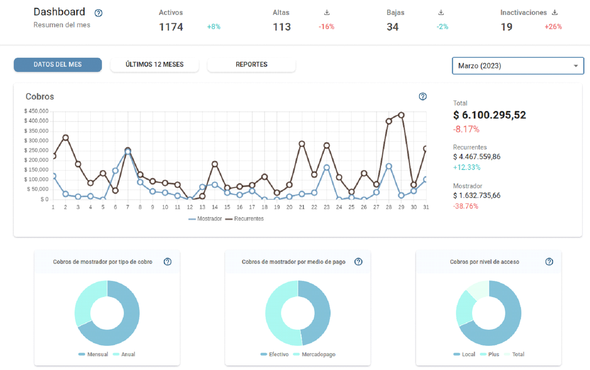
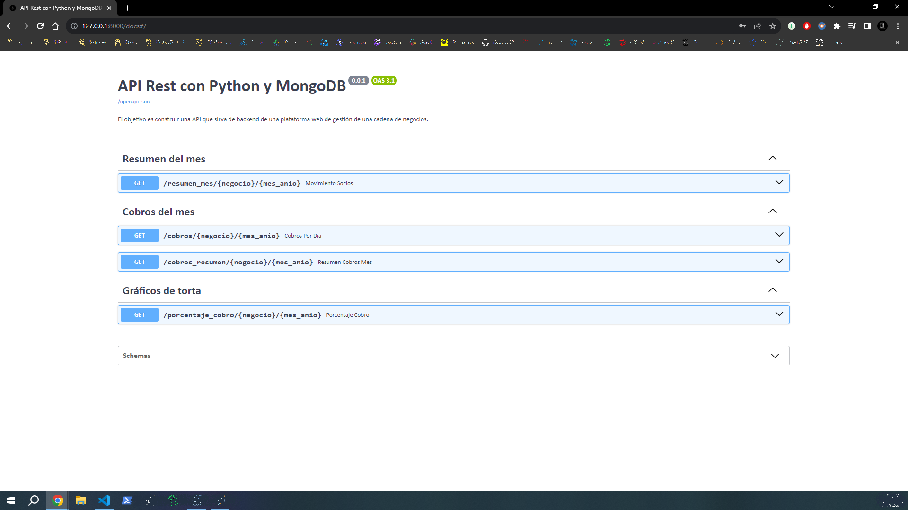
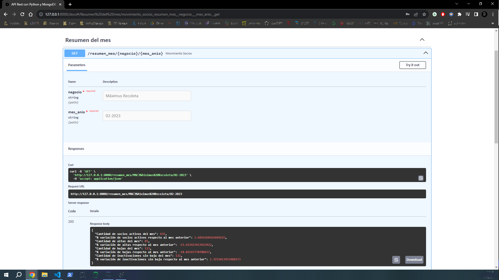

# <h1 align=center> **API Rest c/Python y MongoDB** </h1>

## **Descripción**

El objetivo es construir una API que sirva de backend de una plataforma web de gestión de una cadena de negocios. Las rutas que se deben construir deberán servir a una pantalla específica de Dashboard de la plataforma.
 
<p align="center">

</p>

Los datos son todos ficticios y se encuentran en una base de datos de MongoDB. La base de datos es estática y contiene datos hasta el 11 de junio de 2023. La base es accesible solo con las credenciales de MongoDB.

Se desarrola desde cero una API con la ayuda del framework [FastAPI](https://fastapi.tiangolo.com/es/) y se conecto a la base de datos de [MongoDB](https://www.mongodb.com/es) para realizar las consultas necesarias. En la carpeta *routes* encontraras el desarrollo de las rutas.


## **Instalacion**

Es recomendable instalar las librerias contenidas en el archivo *requirements.txt* asi se asegura el correcto funcionamiento del proyecto. Tambien se recomienda hacer todo esto dentro de un entorno virtual de preferencia asi se evitan problemas con las librerias que ya tengas instaladas en tu computadora.

```bash
pip install -r requirements.txt
```
Asegurate de ubicarte en el directorio donde se encuentra el archivo requirements.txt antes de ejecutar el comando.

Esto instalará automáticamente todas las librerías y las versiones especificadas en el archivo requirements.txt. Cada línea del archivo debe contener el nombre de la libreria y, opcionalmente, la versión especifica o restricciones de version.

Si deseas utilizar un entorno virtual (recomendado), primero activa el entorno virtual antes de ejecutar el comando.

Además, necesitaras crear un archivo *.env* con las credenciales para ser ejecutado de forma local. El cuerpo del archivo sera el siquiente:

```bash
USER = #username
PASSWORD = #password
CLUSTER_URL = #cluster_url
```
Donde #username, #password y #cluster_url deberan ser reemplazados por los valores reales.

## **Recorrido por la API**

### Resumen del mes

En esta sección se muestran datos del movimiento de socios en el periodo seleccionado. Se pueden ver la cantidad de usuarios activos, la cantidad de usuarios que se dieron de alta, la cantidad que se dio de baja y la cantidad de usuarios que perdieron la vigencia sin haberse dado de baja (inactivaciones).

Se creo una ruta en la API que recibe como parámetro un nombre de negocio y una fecha (ej. 09-2022), y devuelva un JSON con los siguientes datos:

* Cantidad de socios activos del mes.
* % variación de socios activos respecto al mes anterior.
* Cantidad de altas del mes.
* % de variación de altas respecto al mes anterior.
* Cantidad de bajas del mes.
* % de variación de bajas respecto al mes anterior.
* Cantidad de inactivaciones sin baja del mes.
* % de variación de inactivaciones sin baja respecto al mes anterior.

La ruta en cuestion para usuarios windows sera: 

http://127.0.0.1:8000/resumen_mes/{negocio}/{mes_anio} 

y para usuarios Linux y Mac: 

http://localhost/resumen_mes/{negocio}/{mes_anio}

Donde {negocio} sera sustituido por el nombre del negocio a consultar y {mes_anio} por la fecha.

### Datos del mes

#### Cobros

Aquí se mostrarán los cobros de cada día del mes, separados por Altas y Recurrencias. Sólo suman las boletas que fueron efectivamente cobradas. Se pueden identificar los cobros de Alta utilizando el atributo ‘source’ de las boletas.

Se creo una ruta en la API que recibe como parámetro un nombre de negocio y una fecha (ej. 09-2022), y devuelve todos los puntos del gráfico de cobros, con 2 valores por cada día del mes: uno de Altas, y otro de cobros de Recurrencia.

La ruta en cuestion para usuarios windows sera: 

http://127.0.0.1:8000/cobros/{negocio}/{mes_anio} 

y para usuarios Linux y Mac: 

http://localhost/cobros/{negocio}/{mes_anio}

Donde {negocio} sera sustituido por el nombre del negocio a consultar y {mes_anio} por la fecha.

Se creo una ruta que recibe como parámetro un nombre de negocio y una fecha (ej. 09-2022), y devuelve:

* El valor total cobrado por el negocio.
* La variación de ese monto respecto al mes anterior.
* El monto total cobrado por recurrencias.
* La variación del monto de recurrencias respecto al mes anterior.
* El monto total cobrado por altas.
* La variación del monto de altas respecto al mes anterior.

La ruta en cuestion para usuarios windows sera: 

http://127.0.0.1:8000/cobros_resumen/{negocio}/{mes_anio} 

y para usuarios Linux y Mac: 

http://localhost/cobros_resumen/{negocio}/{mes_anio}

Donde {negocio} sera sustituido por el nombre del negocio a consultar y {mes_anio} por la fecha.

### Gráficos de torta

Se creo una ruta que recibe como parámetro un nombre de negocio y una fecha (ej. 09-2022), y devuelve:

* El porcentaje de dinero cobrado por cada tipo de cobro.
* El porcentaje de dinero cobrado por cada nivel de acceso.

La ruta en cuestion para usuarios windows sera: 

http://127.0.0.1:8000/porcentaje_cobro/{negocio}/{mes_anio} 

y para usuarios Linux y Mac: 

http://localhost/porcentaje_cobro/{negocio}/{mes_anio}

Donde {negocio} sera sustituido por el nombre del negocio a consultar y {mes_anio} por la fecha.

**El nombre del negocio sera un string y podras elegir entre estas opciones:**

* Máximus Recoleta
* Rokit Body
* Tornasol Mancuerna

**El formato del mes debe ser: “MM-YYYY”. Tener en cuenta que hay datos hasta junio de 2023.**


Se podra acceder a cada ruta desde el navegador o ingresando a la documentacion generada en FastAPI donde podras probar cada uno de los endpoints.

La ruta en cuestion para usuarios windows sera: 

http://127.0.0.1:8000/docs

y para usuarios Linux y Mac: 

http://localhost/docs

<p align="center">

</p>

<p align="center">

</p>


## **Material adicional**

Aca encontraras material adicional de como crear una API FastAPI y tambien de como crear una API con FastAPI y MongoDB.

+ [Crea una API con Python en menos de 5 minutos (Fast API)](https://www.youtube.com/watch?v=J0y2tjBz2Ao)

+ [FastAPI & Mongodb RESTAPI](https://www.youtube.com/watch?v=4e2VW3Nu-64)
<br/>